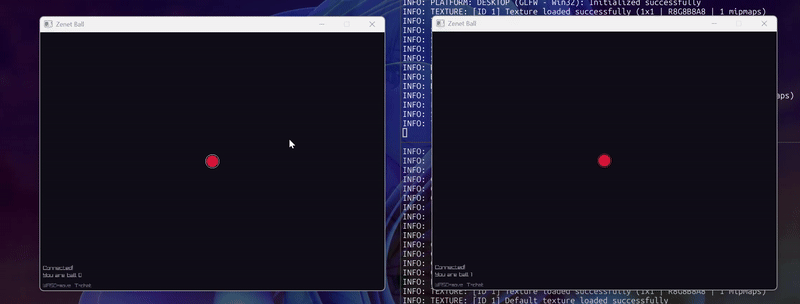

# zenet

> **Experimental** — API is unstable and subject to change.

Connection-oriented game networking library for Zig. Provides a
challenge-response handshake (HMAC-SHA256) and a channel system on top of
unreliable UDP. Inspired by [renet](https://github.com/lucaspoffo/renet).

**Requires Zig 0.15.2**

---

## Examples

Two worked examples are included under `examples/`. They are built from the separate examples package so the root library package stays free of GUI/example dependencies.

### Ball

Up to 4 clients move colored balls around a shared window. Demonstrates `ReliableOrdered` for session events, `UnreliableLatest` for ball positions, and `Unreliable` for chat.



```sh
zig build --build-file examples/build.zig ball-server          # terminal 1
zig build --build-file examples/build.zig ball-client          # terminal 2
zig build --build-file examples/build.zig ball-client -- 1.2.3.4
```

Controls: `WASD` to move · `T` to chat · `Esc` to cancel chat

### Pong

Two-player networked pong. Demonstrates `UnreliableLatest` for ball/paddle state and player input, `ReliableOrdered` for control events, and `Unreliable` for chat.

```sh
zig build --build-file examples/build.zig pong-server          # terminal 1
zig build --build-file examples/build.zig pong-client          # terminal 2
zig build --build-file examples/build.zig pong-client          # terminal 3
zig build --build-file examples/build.zig pong-client -- 1.2.3.4
```

Controls: `W`/`S` to move · `T` to chat · `Space` to ready up after a round

---

## Contents

- [Quick start](#quick-start)
- [Options](#options)
- [Channels](#channels)
- [TransportServer / TransportClient](#transportserver--transportclient)
- [Custom socket](#custom-socket)
- [Secure connections / ConnectToken](#secure-connections--connecttoken)
- [Raw state machines](#raw-state-machines)
- [Testing with LoopbackSocket](#testing-with-loopbacksocket)
- [Project structure](#project-structure)

---

## Quick start

```zig
const zenet = @import("zenet");
const std   = @import("std");

const opts: zenet.Options = .{
    .max_clients     = 64,
    .max_payload_size = 512,
    .channels        = &.{ .Unreliable, .UnreliableLatest, .ReliableOrdered, .ReliableUnordered },
};

// --- server ---

const Srv = zenet.TransportServer(opts, void); // void = built-in UDP

var srv = try Srv.init(allocator, zenet.ServerConfig.init(
    1,                          // protocol_id
    5  * std.time.ns_per_s,     // handshake_alive_ns
    30 * std.time.ns_per_s,     // client_timeout_ns
    &.{},                       // public addresses (secure mode only)
    false,                      // secure
    [_]u8{0} ** 32,             // challenge key
    null,                       // secret key (secure mode only)
), try std.net.Address.parseIp4("0.0.0.0", 9000));
defer srv.deinit();

// game loop
while (running) {
    srv.tick();

    while (srv.pollEvent()) |ev| switch (ev) {
        .ClientConnected    => |e| std.debug.print("connected cid={}\n",    .{e.cid}),
        .ClientDisconnected => |e| std.debug.print("disconnected cid={}\n", .{e.cid}),
    };

    // zero-copy: pointer into the ring buffer — no data[] copy
    while (srv.peekMessage()) |msg| {
        const data = srv.messageData(msg);
        std.debug.print("ch={} data={s}\n", .{ msg.channel_id, data });
        // echo back
        try srv.sendOnChannel(msg.cid, msg.channel_id, data);
        srv.consumeMessage();
    }
}

// --- client ---

const Cli = zenet.TransportClient(opts, void);

var cli = try Cli.init(
    .{ .protocol_id = 1, .server_addr = server_addr },
    try std.net.Address.parseIp4("0.0.0.0", 0),
);
defer cli.deinit();

try cli.connect();

while (running) {
    cli.tick();

    while (cli.pollEvent()) |ev| switch (ev) {
        .Connected    => std.debug.print("connected\n",    .{}),
        .Disconnected => std.debug.print("disconnected\n", .{}),
    };

    // zero-copy: pointer into the ring buffer — no data[] copy
    while (cli.peekMessage()) |msg| {
        std.debug.print("from server ch={} data={s}\n",
            .{ msg.channel_id, cli.messageData(msg) });
        cli.consumeMessage();
    }

    // send on channel 2 (ReliableOrdered)
    try cli.sendOnChannel(2, "hello");
}
```

---

## Options

Both sides must use the **same** `Options` value — the wire format depends on it.

```zig
const opts: zenet.Options = .{
    // Connection limits
    .max_clients          = 1024,  // max simultaneous connected clients
    .max_pending_clients  = null,  // defaults to max_clients * 2; must be power of 2

    // Wire format
    .max_payload_size     = 1024,  // bytes per payload (includes 3-byte channel header)
    .user_data_size       = 256,   // bytes carried in ConnectToken.user_data

    // Channels  (index = channel_id passed to sendOnChannel)
    .channels             = &.{ .Unreliable, .UnreliableLatest, .ReliableOrdered, .ReliableUnordered },

    // Reliable channel tuning
    .reliable_buffer      = 64,    // unACKed send slots per channel per peer
    .reliable_resend_ns   = 100 * std.time.ns_per_ms,  // minimum retransmit interval (floor for RTT-based RTO)
    .reliable_ordered_recv_window = 32, // future-packet buffer depth for ReliableOrdered

    // Queue sizes
    .outgoing_queue_size  = 256,
    .events_queue_size    = 256,
    .messages_queue_size  = 256,
    .nonce_window         = 256,   // replay-protection window

    // Optional custom ConnectToken type (void = use built-in default)
    .ConnectToken         = void,
};
```

`reliable_resend_ns` acts as the **minimum floor** for the per-client adaptive
retransmit timeout. The transport layers track a smoothed RTT (SRTT) per
connection and compute `RTO = max(srtt * 2, reliable_resend_ns)`, so on low
latency links retransmits happen sooner and on high latency links spurious
retransmits are avoided.

---

## Channels

Every message is sent on a numbered channel (index into `opts.channels`).
Four kinds are available:

| Kind                 | Delivery         | Ordering | Use for                            |
|----------------------|------------------|----------|------------------------------------|
| `Unreliable`         | fire-and-forget  | none     | audio, debug overlays              |
| `UnreliableLatest`   | fire-and-forget  | drops older | positions, orientations         |
| `ReliableOrdered`    | ACK + retransmit | in order | game events, match flow            |
| `ReliableUnordered`  | ACK + retransmit | none     | idempotent reliable notifications  |

```zig
// opts.channels = &.{ .Unreliable, .UnreliableLatest, .ReliableOrdered, .ReliableUnordered }
//                         0               1                 2                   3

// send from client
try cli.sendOnChannel(0, "fire-and-forget");
try cli.sendOnChannel(1, &std.mem.toBytes(player_position));
try cli.sendOnChannel(2, "must arrive");
try cli.sendOnChannel(3, "must arrive, order does not matter");

// receive on server
while (srv.peekMessage()) |msg| {
    switch (msg.channel_id) {
        0 => ..., // Unreliable
        1 => ..., // UnreliableLatest — older packets already dropped
        2 => ..., // ReliableOrdered
        3 => ..., // ReliableUnordered
        else => {},
    }
    srv.consumeMessage();
}
```

`sendOnChannel` returns `error.ReliableBufferFull` when all `reliable_buffer`
slots are occupied by unACKed messages for that peer. Back off and retry on the
next tick.

---

## TransportServer / TransportClient

The transport wrappers own a socket and drive the full I/O loop for you.
Pass `void` as the second type argument to use the built-in UDP socket.

### TransportServer

```zig
const Srv = zenet.TransportServer(opts, void);

// init
var srv = try Srv.init(allocator, server_config, bind_address);
defer srv.deinit();

// --- per-tick ---
srv.tick(); // recv → state machine → send → retransmit reliable

// lifecycle events
while (srv.pollEvent()) |ev| {
    switch (ev) {
        .ClientConnected => |e| {
            // e.cid       : u64           — stable slot index, 0-based
            // e.addr      : std.net.Address
            // e.user_data : ?[opts.user_data_size]u8  (null if plain connect)
        },
        .ClientDisconnected => |e| {
            // e.cid, e.addr
        },
    }
}

// incoming messages — zero-copy (preferred for large payloads)
while (srv.peekMessage()) |msg| {
    // msg : *const MessageView — points into ring buffer, no data copy
    // msg.cid        : u64
    // msg.channel_id : u8
    // Use srv.messageData(msg) to read the payload bytes.
    _ = srv.messageData(msg);
    srv.consumeMessage(); // advance the ring buffer and release pooled bytes
}
// or copy-out variant (simpler, fine for small payloads)
while (srv.pollMessage()) |msg| {
    _ = msg.data[0..msg.len]; // msg is a value copy
}

// outgoing
try srv.sendOnChannel(cid, channel_id, data_slice);

// access the underlying state machine (e.g. to send raw payloads)
const sm = srv.getStateMachine(); // *Server(opts)
try sm.sendPayload(cid, payload_body);
```

### TransportClient

```zig
const Cli = zenet.TransportClient(opts, void);

var cli = try Cli.init(client_config, bind_address);
defer cli.deinit();

try cli.connect();         // plain
// try cli.connectSecure(token); // with ConnectToken

// --- per-tick ---
cli.tick();

while (cli.pollEvent()) |ev| {
    switch (ev) {
        .Connected    => {},
        .Disconnected => {},
    }
}

// zero-copy (preferred for large payloads)
while (cli.peekMessage()) |msg| {
    // msg : *const MessageView — points into ring buffer, no data copy
    // Use cli.messageData(msg) to read the payload bytes.
    _ = cli.messageData(msg);
    cli.consumeMessage();
}
// or copy-out variant
while (cli.pollMessage()) |msg| {
    _ = msg.data[0..msg.len];
}

try cli.sendOnChannel(channel_id, data_slice);

cli.disconnect(); // graceful
```

### ServerConfig

```zig
const cfg = zenet.ServerConfig.init(
    protocol_id,          // u32  — must match client
    handshake_alive_ns,   // u64  — ns; pending handshake lifetime
    client_timeout_ns,    // u64  — ns; idle disconnect threshold
    public_addresses,     // []const std.net.Address  (secure mode)
    secure,               // bool — require signed ConnectToken
    challenge_key,        // [32]u8
    secret_key,           // ?[32]u8  (required when secure = true)
);
```

### ClientConfig

```zig
const cfg: zenet.ClientConfig = .{
    .protocol_id        = 1,
    .server_addr        = server_address,
    .connect_timeout_ns = 5  * std.time.ns_per_s,  // ns
    .timeout_ns         = 30 * std.time.ns_per_s,
};
```

---

## Custom socket

Pass any type as the second argument to `TransportServer` / `TransportClient`.
The type must satisfy the following interface exactly — the compiler checks every
parameter type and return type and emits a focused `@compileError` if anything
is wrong:

```zig
const MySocket = struct {
    // Called by TransportServer/Client.init to bind the socket.
    pub fn open(addr: std.net.Address) !MySocket { ... }

    // Called by deinit.
    pub fn close(self: *MySocket) void { ... }

    // Non-blocking receive.  Return null when no datagram is available.
    // The returned struct must have exactly these two fields with these types.
    pub fn recvfrom(self: *MySocket, buf: []u8) ?struct {
        addr: std.net.Address,
        len:  usize,
    } { ... }

    // Fire-and-forget send.
    pub fn sendto(self: *MySocket, addr: std.net.Address, data: []const u8) void { ... }
};

const Srv = zenet.TransportServer(opts, MySocket);
```

What the compiler checks (examples of the errors you get when wrong):

```
Socket missing: pub fn open(std.net.Address) !MySocket
Socket.open parameter must be std.net.Address, got u16
Socket.open error-union payload must be MySocket, got void
Socket.close must return void, got u32
Socket.recvfrom must return an optional (?RecvResult)
Socket.recvfrom result .addr must be std.net.Address
Socket.sendto third parameter must be []const u8, got []u8
```

When a custom socket is provided, `TransportServer` and `TransportClient` also
expose `initWithSocket` for use-cases where you construct the socket yourself
(e.g. in tests):

```zig
var srv = try zenet.TransportServer(opts, MySocket)
    .initWithSocket(allocator, server_config, my_socket_value);

var cli = try zenet.TransportClient(opts, MySocket)
    .initWithSocket(client_config, my_socket_value);
```

---

## Secure connections / ConnectToken

When `ServerConfig.secure = true`, the server requires every `ConnectionRequest`
to carry a signed token issued by a trusted matchmaking server.

### Using the built-in DefaultConnectToken

```zig
// matchmaking server — has the secret key
const token = try zenet.handshake.DefaultConnectToken(
    opts.user_data_size,
    opts.max_token_addresses,
).create(
    client_id,
    expires_at,       // absolute ns timestamp
    public_addresses, // []const std.net.Address
    user_data,        // [opts.user_data_size]u8
    &secret_key,
);

// client — receives token over HTTPS/TCP and uses it
try cli.connectSecure(token);
```

### Custom ConnectToken

Set `opts.ConnectToken = MyToken` and implement the interface below.
The compiler validates the signatures precisely:

```zig
const MyToken = struct {
    pub const wire_size = 128; // exact byte size on the wire

    user_data: [opts.user_data_size]u8, // required field, exact type

    pub fn encode(self: *const MyToken, out: *[wire_size]u8) void { ... }

    pub fn decode(bytes: *const [wire_size]u8) ?MyToken { ... }

    pub fn verify(
        self:       *const MyToken,
        now:        u64,
        secret_key: *const [32]u8,
    ) bool { ... }

    pub fn authorizeAddress(
        self: *const MyToken,
        addr: std.net.Address,
    ) bool { ... }
};
```

Errors emitted when the interface is wrong:

```
ConnectToken must have: pub const wire_size: usize
ConnectToken must have: pub fn encode(*const @This(), *[wire_size]u8) void
ConnectToken must have: pub fn decode(*const [wire_size]u8) ?@This()
ConnectToken must have: pub fn authorizeAddress(*const @This(), std.net.Address) bool
```

---

## Raw state machines

`zenet.Server` and `zenet.Client` are pure state machines with no I/O — drive
the socket yourself if you need full control over when packets are sent.

### Server

```zig
const Srv = zenet.Server(opts);

var srv = try Srv.init(allocator, config);
defer srv.deinit();

// each tick
srv.update(try std.time.Instant.now());

// feed a received datagram
try srv.handlePacket(source_addr, datagram_bytes);

// drain outgoing — zero-copy peek/consume pattern
while (srv.peekOutgoing()) |out| {
    // out : *const Outgoing — points into the ring buffer
    // out.addr   : std.net.Address
    // out.packet : Packet(opts)
    udp_send(out.addr, out.packet);
    srv.consumeOutgoing();
}
// or copy-out variant
while (srv.pollOutgoing()) |out| {
    udp_send(out.addr, out.packet);
}

// drain events — zero-copy peek/consume pattern
while (srv.peekEvent()) |ev| {
    switch (std.meta.activeTag(ev.*)) {
        .ClientConnected    => { _ = ev.ClientConnected.cid; },
        .ClientDisconnected => { _ = ev.ClientDisconnected.cid; },
        .PayloadReceived    => { _ = ev.PayloadReceived.payload.body; },
    }
    srv.consumeEvent();
}
// or copy-out variant
while (srv.pollEvent()) |ev| { ... }

// send a raw payload body to a connected client (copies into outgoing ring)
try srv.sendPayload(cid, payload_body); // payload_body: []const u8

// zero-copy send: reserve a slot and write directly (avoids one memcpy)
const out = try srv.reservePayloadSlot(cid);
const body = &out.packet.Payload.body;
// write your channel header + data into body[0..], then set the length:
out.packet.Payload.len = body_len;
```

### Client

```zig
const Cli = zenet.Client(opts);

var cli = try Cli.init(.{ .protocol_id = 1, .server_addr = server_addr });

try cli.connect(); // or cli.connectSecure(token)

// each tick
cli.update(try std.time.Instant.now());

try cli.handlePacket(datagram_bytes);

// drain outgoing — zero-copy peek/consume pattern
while (cli.peekOutgoing()) |out| {
    udp_send(out.addr, out.packet);
    cli.consumeOutgoing();
}

while (cli.peekEvent()) |ev| {
    switch (std.meta.activeTag(ev.*)) {
        .Connected       => {},
        .Disconnected    => {},
        .PayloadReceived => { _ = ev.PayloadReceived.body; },
    }
    cli.consumeEvent();
}

// send a raw payload body (copies into outgoing ring)
try cli.sendPayload(payload_body);

// zero-copy send: reserve a slot and write directly
const out = try cli.reservePayloadSlot();
out.packet.Payload.len = body_len;

cli.disconnect();
```

---

## Testing with LoopbackSocket

`zenet.LoopbackSocket` is an in-memory socket backed by two fixed-size queues.
Create a `Pair`, get the two socket endpoints from it, and pass them to
`initWithSocket` — no OS network stack involved.

```zig
const LoopbackSocket = zenet.LoopbackSocket;

var pair: LoopbackSocket.Pair = .{};

const srv_addr = std.net.Address.initIp4(.{ 127, 0, 0, 1 }, 9000);
const cli_addr = std.net.Address.initIp4(.{ 127, 0, 0, 1 }, 9001);

var srv = try zenet.TransportServer(opts, LoopbackSocket)
    .initWithSocket(allocator, server_config, pair.serverSocket(srv_addr));
defer srv.deinit();

var cli = try zenet.TransportClient(opts, LoopbackSocket)
    .initWithSocket(client_config, pair.clientSocket(cli_addr));
defer cli.deinit();

try cli.connect();

// drive the handshake — packets flow through the shared queues
for (0..10) |_| { cli.tick(); srv.tick(); }

const ev = srv.pollEvent().?;
std.debug.assert(ev == .ClientConnected);
```

The `Pair` must remain alive on the stack for the lifetime of both transport
objects, because the sockets hold interior pointers into it.

---

## Project structure

```
src/
  root.zig              public API re-exports and Options
  packet.zig            wire-format serialization/deserialization
  channel.zig           channel header encoding, channel kind helpers,
                        ReliableState, RttState, recv state machines
  handshake.zig         HMAC challenge tokens, DefaultConnectToken,
                        validateConnectTokenInterface
  payload_pool.zig      O(1) free-list pool for inbound message bytes
  ring_buffer.zig       fixed-capacity queue with peek/consume zero-copy API
  addr.zig              address normalization for hash-map keys
  nonce.zig             sliding-window replay protection
  tests.zig             state-machine integration tests + loopback transport tests

  server/
    server.zig          Server state machine (handlePacket, sendPayload,
                        reservePayloadSlot, peekOutgoing/consumeOutgoing, …)
    config.zig          ServerConfig
    connection.zig      per-client connection state
    error.zig           ServerError

  client/
    client.zig          Client state machine (handlePacket, sendPayload,
                        reservePayloadSlot, peekOutgoing/consumeOutgoing, …)
    config.zig          ClientConfig
    error.zig           ClientError

  transport/
    socket.zig          RecvResult type + validateSocketInterface
    udp.zig             built-in non-blocking UDP socket (Windows + POSIX)
    loopback.zig        in-memory LoopbackSocket + Pair for testing
    server.zig          TransportServer — owns socket, drives I/O loop,
                        per-client RTT tracking
    client.zig          TransportClient — owns socket, drives I/O loop,
                        per-connection RTT tracking

  validation/
    root.zig            re-exports all validation helpers
    options.zig         comptime checks for Options (channel counts, sizes, …)
    socket.zig          comptime checks for custom socket interface
    connect_token.zig   comptime checks for custom ConnectToken interface
```

---

## License

MIT
